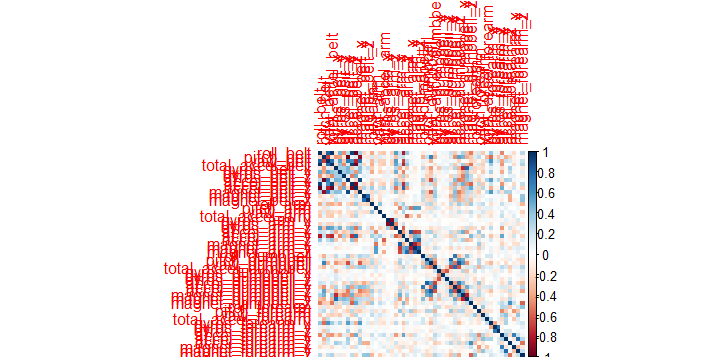
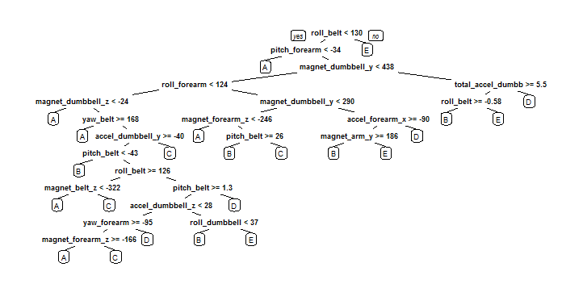

##  Install required R packages

Following packages are considered for the project ,  there are multiple ways to create the prediction , few packages like caret , rpart are to be used in all possible solution,  few packages like rattle , repmis are to be used depnding on developer's choice
```{r} 
install.packages("caret")
install.packages("rpart")
install.packages("rpart.plot")
install.packages("randomForest")
install.packages("corrplot")
install.packages("rattle"); 
install.packages("repmis")
```

## Load the R packages
```{r} 
library(caret)
library(rpart)
library(rpart.plot)
library(randomForest)
library(corrplot)
library(rattle); 
library(repmis);
``` 

## Data Importing

Import from the url
```{r} 
# trainingURL <- "https://d396qusza40orc.cloudfront.net/predmachlearn/pml-training.csv"
# testingURL <- "https://d396qusza40orc.cloudfront.net/predmachlearn/pml-testing.csv"
# training <- source_data(trainingURL, na.strings = c("NA", "#DIV/0!", ""), header = TRUE)
# testing <- source_data(testingURL, na.strings = c("NA", "#DIV/0!", ""), header = TRUE)
``` 

Alternative -  download the data in local machine and import data from local file
```{r} 
training <- read.csv("F:/Data Science/mc/programs/week4/pml-training.csv", na.strings = c("NA", ""))
testing <- read.csv("F:/Data Science/mc/programs/week4/pml-testing.csv", na.strings = c("NA", ""))

dim(training)
##### [1] 19622   160
dim(testing)
##### [1]  20 160
``` 
The training data set contains 19622 observations and 160 variables. 
The testing data set contains 20 observations and 160 variables.
The "classe" variable in the training set is the outcome to predict.


## Data cleaning

Remove columns that contain NA missing values
```{r}
training <- training[, colSums(is.na(training)) == 0]
testing <- testing[, colSums(is.na(testing)) == 0]
``` 
Remove variable that does not contribute much to predict the the outcome 'classe'.
Open the data csv file in xls, you can see that the index column, user_name, raw_timestamp_part_1, raw_timestamp_part_2, cvtd_timestamp, new_window, num_window have very littile predicting power for the outcome 'classe'. These columns are the first seven column in the csv file
```{r}
trainingData <- training[, -c(1:7)]
testingData <- testing[, -c(1:7)]

dim(trainingData)
### [1] 19622    53
dim(testingData)
### [1] 20 53
```
The cleaned training data set contains 19622 observations and 53 variables.
The testing data set contains 20 observations and 53 variables. 


## Data spliting

The training data needs to be splitted to a training set and a validaion set in order to take care of out-of-sample errors.
We are using a 70:30 ratio for training data set and validation data set
```{r}
set.seed(7826) 
inTrain <- createDataPartition(trainingData$classe, p = 0.7, list = FALSE)
finalTrainingData <- trainingData[inTrain, ]
validationData <- trainingData[-inTrain, ]

dim(finalTrainingData)
### [1] 13737    53
dim(validationData)
### [1] 5885   53
```
The final training data set contains 13737 observations and 53 variables.
The validation data set contains 5885 observations and 53 variables. 

## Prediction 

We should use 5-fold cross validation when applying the algorithm.
default setting in trainControl function is 10, set the vallue as 5
```{r}
controlRf <- trainControl(method="cv", 5)
```

### Apply prediction algorithm on testing data set (Random Forest)

There are mutiple prediction algorithm which can be selected
In this project we have selected Random Forest algorithm 
Actually I have tried many algorithms and finally selected random Forest as it produces best accuracy among the tried methdods because it automatically selects important variables and is robust to correlated covariates & outliers in general. 

```{r}
modelRf <- train(classe ~., data=finalTrainingData, method="rf", trControl=controlRf, ntree=250)
print(modelRf, digits = 4)

#### Random Forest 

#### 13737 samples
#### 52 predictor
#### 5 classes: 'A', 'B', 'C', 'D', 'E' 

#### No pre-processing
#### Resampling: Cross-Validated (5 fold) 

#### Summary of sample sizes: 10990, 10988, 10990, 10990, 10990 

#### Resampling results across tuning parameters:
  
#### mtry  Accuracy  Kappa   Accuracy SD  Kappa SD
####  2    0.9905    0.9880  0.001208     0.001528
#### 27    0.9909    0.9885  0.001384     0.001750
#### 52    0.9853    0.9814  0.003874     0.004902

####  Accuracy was used to select the optimal model using  the largest value.
#### The final value used for the model was mtry = 27. 

### Estimate the performance of the model on the validation data set.
predictRf <- predict(modelRf, validationData)
confusionMatrix(validationData$classe, predictRf)

#### Confusion Matrix and Statistics
#### 
####           Reference
#### Prediction    A    B    C    D    E
####          A 1669    3    0    0    2
####          B    9 1129    1    0    0
####          C    0    2 1015    9    0
####         D    0    0   14  944    6
####          E    0    1    1    4 1076
#### 
#### Overall Statistics
####                                           
####                Accuracy : 0.9912          
####                  95% CI : (0.9884, 0.9934)
####     No Information Rate : 0.2851          
####     P-Value [Acc > NIR] : < 2.2e-16       
####                                           
####                   Kappa : 0.9888          
####  Mcnemar's Test P-Value : NA              
#### 
#### Statistics by Class:
#### 
####                      Class: A Class: B Class: C Class: D Class: E
#### Sensitivity            0.9946   0.9947   0.9845   0.9864   0.9926
#### Specificity            0.9988   0.9979   0.9977   0.9959   0.9988
#### Pos Pred Value         0.9970   0.9912   0.9893   0.9793   0.9945
#### Neg Pred Value         0.9979   0.9987   0.9967   0.9974   0.9983
#### Prevalence             0.2851   0.1929   0.1752   0.1626   0.1842
#### Detection Rate         0.2836   0.1918   0.1725   0.1604   0.1828
#### Detection Prevalence   0.2845   0.1935   0.1743   0.1638   0.1839
#### Balanced Accuracy      0.9967   0.9963   0.9911   0.9912   0.9957
```
Estimate accuracy
```{r}
accuracy <- postResample(predictRf, validationData$classe)
print(accuracy)
#### Accuracy     Kappa 
#### 0.9911640 0.9888225 

outOfSample <- 1 - as.numeric(confusionMatrix(validationData$classe, predictRf)$overall[1])
print(outOfSample)
#### [1] 0.008836024
```
The acuracy rate is 0.991 

## Predicting for Test Data Set
Use random forests to predict the outcome variable classe for the testing set.
```{r}
result <- predict(modelRf, testingData)
#### 0.9911640 0.9888225 
print (result)
#### [1] B A B A A E D B A A B C B A E E A B B B
#### Levels: A B C D E
```

## Appendix
Draw few plots

### Correlation Matrix 
```{r}
plot1 <- cor(finalTrainingData[, -length(names(finalTrainingData))]) 
corrplot(plot1, method="color")
```


### Decision Tree 
```
treeModel <- rpart(classe ~ ., data=finalTrainingData, method="class")
prp(treeModel) 
```


##  End of Project report
